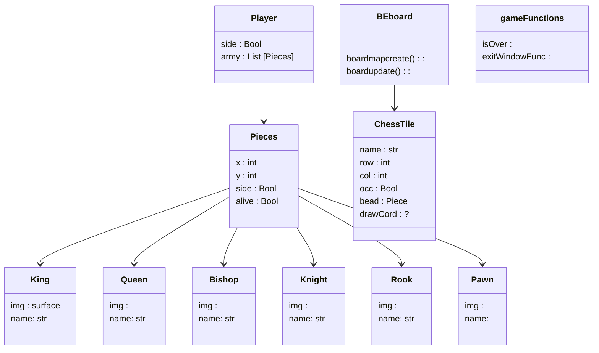

# Mermaid Tutorial

```mermaid
classDiagram
    class Player{
        side : Bool
        army : List [Pieces]
    }
    class Pieces{
        x : int
        y : int
        side : Bool
        alive : Bool

    }

    class King{
        img : surface
        name: str
        
    }

    class Queen{
        img : 
        name: str
        
    }

    class Bishop{
        img : 
        name: str
        
    }

    class Rook{
        img : 
        name: str

    }

    class Knight{
        img : 
        name: str
        
    }

    class Pawn{
        img : 
        name: 
        
    }


    class BEboard{
        boardmapcreate() : 
        boardupdate() :

    }

    class ChessTile{
        name : str
        row : int
        col : int
        occ : Bool
        bead : Piece
        drawCord : ?
    }


    Player --> Pieces
    Pieces --> King
    Pieces --> Queen
    Pieces --> Bishop
    Pieces --> Knight
    Pieces --> Rook
    Pieces --> Pawn

    BEboard --> ChessTile

    class gameFunctions{
        isOver : 
        exitWindowFunc : 
        
    }


    
```
